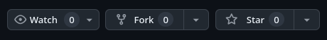
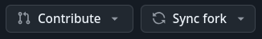

# Testing 123

Vi and Vw testing!

## Steps to fork and contribute!

1. "Fork" on this page: 
2. Clone *your* fork locally
3. Make changes with `add`, `commit`
4. Push changes to your fork
5. Click "Contribute": 
  - This submits a PR (Pull Request)

You should be able to search internet for answers, but feel free to ask Q's.
Good luck :)

adds first edit, says Howdy

